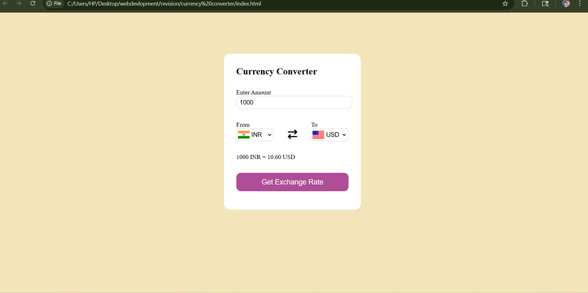

# 💱 Currency Converter Web App


A responsive Currency Converter web application built using HTML, CSS, and JavaScript. It allows users to convert currencies in real-time using live exchange rates fetched from an external API.

## 🔗 Live Demo
https://jitendradangi.github.io/currency-converter/

## 🚀 Features
- Convert between multiple currencies
- Real-time exchange rates using API
- Simple and user-friendly interface
- Instant conversion on input
- Responsive design for all devices

## 🛠️ Tech Stack
- HTML
- CSS
- JavaScript
- Exchange Rate API

- ## 📷 Screenshot


## ⚙️ How It Works
1. Select base currency and target currency  
2. Enter the amount  
3. App fetches live exchange rates from API  
4. Converted value is displayed instantly

## 📚 What I Learned
- API integration using JavaScript
- Fetch API and async/await
- DOM manipulation
- Building real-world frontend project

## 📂 Installation
```bash
git clone https://github.com/jitendradangi/currency-converter.git
cd currency-converter
start index.html
